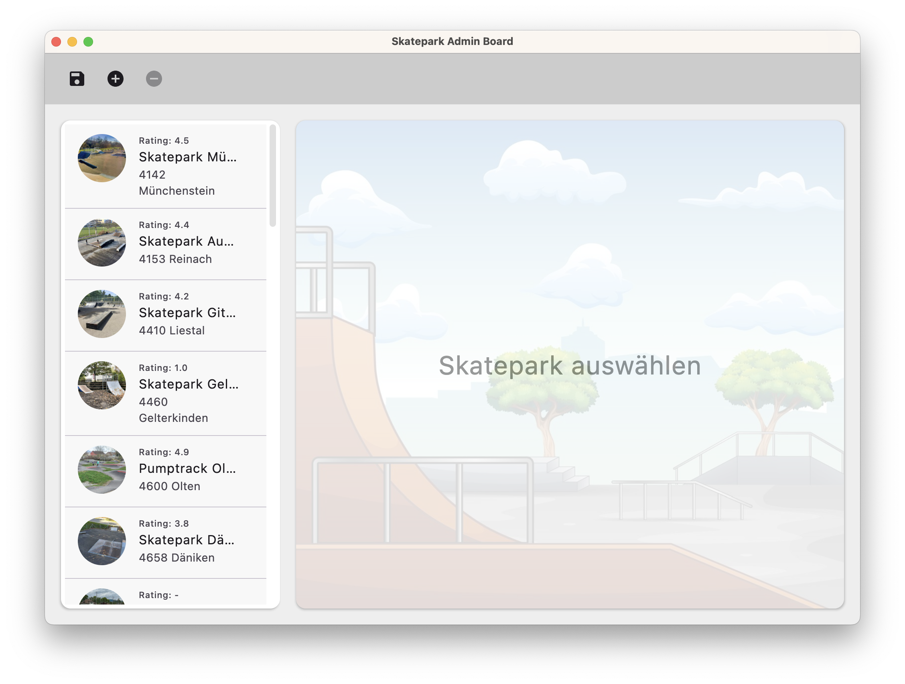
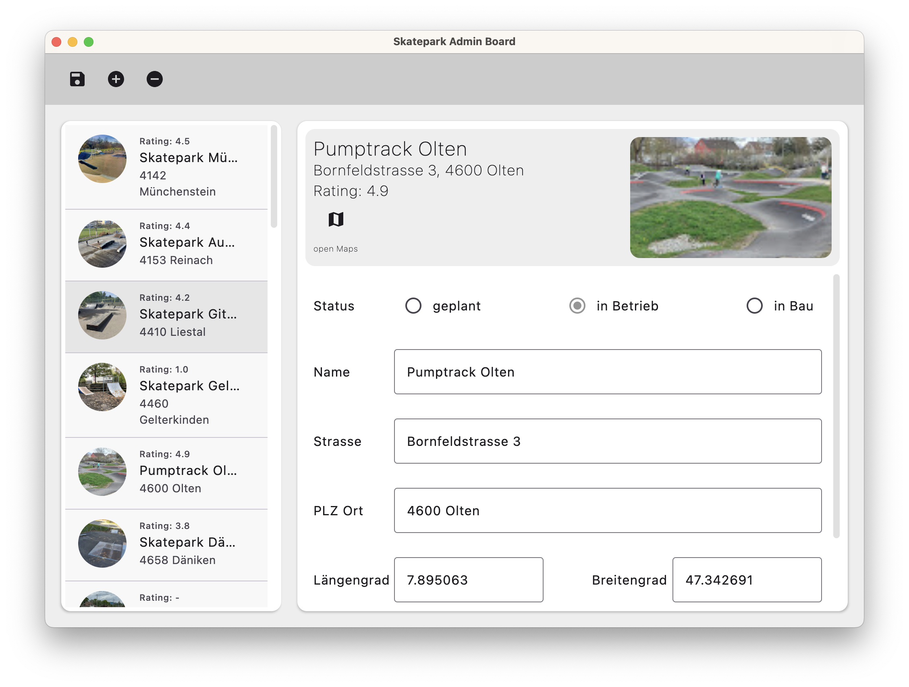

== edea Assignment 1 : SkateParks

=== Bearbeitet von

* _Marco Jucker_

=== Abgabe

* Dienstag, 6.10.2026, 15:00 Uhr

Die Abgabe erfolgt durch einen `Push` auf den `main`-Branch Ihres GitHub-Repositories.

=== Initiale Schritte
[circle]
* Tragen Sie ihren Namen unter "Bearbeitet von" ein.
* Pushen Sie diese Änderung am besten sofort ins Git-Repository (z.B. via `Git -> Commit… -> Commit&Push`)

=== Die Aufgabe: Desktop Applikation für die Verwaltung von SkateParks

Diese Applikation dient Mitarbeitenden des Bundes bei der Verwaltung der in der Schweiz vorhandenen/geplanten Skateparks. In einer späteren Ausbaustufe (in Assignment 2) soll es möglich sein, die Einsatzplanung für die Wartung und Pflege der SkateParks zu koordinieren.

Im Projekt enthalten ist ein umfangreicher "Starter-Code". Diesen gilt es zu vervollständigen, so dass eine Applikation mit einer Toolbar und einem Master-Detail-View für Schweizer Skateparks entsteht.

Diese beiden Bilder zeigen lediglich _eine_ mögliche Lösung. Ihre Applikation muss nicht exakt so aussehen.

In `SharedComposables` sind wiederverwendbare Composable Functions enthalten. Es wird empfohlen diese zu verwenden.

=== Anforderungen
[circle]
* Gewünschte Funktionalität
** Darstellung aller Schweizer SkateParks ("Explorer")
** Editor zur Veränderung eines `SkateParks`
*** Der Header zeigt mindestens die Werte 'name', 'fulladdress' und 'imageBitmap' als Read-Only-Felder bzw. als Bild.
*** Das Formular besteht mindestens aus editierbaren Feldern für 'status', 'name', 'street', 'zipPlace', 'latitude' und 'longitude'.
** Master-Detail-View
*** Selection-Handling im SkatePark-Explorer
*** Selektion im Explorer führt zur Anzeige des selektierten SkateParks im Editor
** neuer SkatePark kann angelegt werden ("Create")
** bestehender SkatePark kann gelöscht werden ("Delete")
** SkatePark kann modifiziert werden ("Update")
*** Jede Änderung eines SkateParks im Formular wird sofort auch im Explorer und im Header angezeigt
** _Hinweis_: Die Verwendung einer Datenbank oder einer anderen Speichermöglichkeit ist in dieser Aufgabe *nicht* gefordert (keine Persistenz; das "Save" Icon speichert Änderungen nur in memory, nach einem Neustart ist wieder der ursprüngliche Datenbestand).
* Implementierung einer Composable Function `GenericExplorer` in `SharedComposables.kt`.
** `GenericExplorer` ist insbesondere unabhängig von `SkatePark`und kann für beliebige Model-Klassen verwendet werden
* Architektur
** klare Aufgabenverteilung zwischen Model und View
** Die Implementierungssprache für die gesamte Applikation ist Kotlin
** Das UI ist mit Compose Multiplatform implementiert
** Keine Verwendung von Libraries, die nicht bereits im Unterricht eingesetzt wurden
* TestCases
** `SkateParkTest` deckt bereits einen grösseren Teil der Funktionalität von `SkatePark` ab. Dieser muss nur ergänzt werden (siehe ToDos im Code).
** `FederalAdministrationTest` soll die gesamte Funktionalität von `FederalAdministration` abdecken.
* Dokumentation
** Alle Funktionen, die sich im File `SharedComposables.kt` befinden, sind entsprechend zu dokumentieren. _(Siehe Kapitel Code Dokumentation)_

=== Code Dokumentation
Jede Funktion der `SharedComposables` mit einem mehrzeiligen Dokumentationskommentar  ``/\**`` ``*/``  beschreiben werden.

Dabei soll das von Kotlin zur Verfügung gestellte https://kotlinlang.org/docs/kotlin-doc.html[KDoc-Format] verwendet werden.
Darin sind folgende Punkte enthalten:

. Kurzbeschreibung der Funktion
. Detailliertere Beschreibung der Funktion. Darin wird oft auch erwähnt, wann und wie genau die Funktion angewendet werden kann.
. Auflistung der Parameter/Properties/Constructors/Return-Values mit Namen und wofür diese in der Funktion verwendet werden.

**Beispiel:**

 /**
 * Komponierbare Funktion, die einen einfachen Button anzeigt.
 *
 * Diese komponierbare Funktion erstellt einen Button mit dem angegebenen [text] und dem [onClick]-Rückruf.
 *
 * @param text Der Text, der auf dem Button angezeigt werden soll.
 * @param onClick Der Callback, der aufgerufen werden soll, wenn der Button geklickt wird.
 */
@Composable
fun SimpleButton(text: String, onClick: () -> Unit) {
    Button(onClick = onClick) {
        Text(text = text)
    }
}

_Hinweis_: Natürlich können auch die eigenen Funktionen in dieser Weise dokumentiert werden.

=== Bewertung
Es können in diesem Assignment maximal 25 Punkte erreicht werden. Der Fokus liegt dabei, neben der Umsetzung der gewünschten Funktionalität, auf der Code-Qualität.

[cols=3, format=dsv]
|===
Bereich:Mögliche Punktzahl:erreichte Punkte
*Funktionalitäten*:*12 Pt. total*: *total*
Darstellung aller Schweizer SkateParks:2 Pt.:
Editor (mit Header und Formular) zur Veränderung eines SkateParks:2 Pt.:
Master-Detail-View (Selection-Handling Explorer/Editor):2 Pt.:
Neuer SkatePark kann angelegt werden "Create":2 Pt.:
Bestehender SkatePark kann gelöscht werden "Delete":2 Pt.:
SkatePark kann modifiziert werden "Update" (inklusive Liveupdate im Header & Explorer):2 Pt.:

*Generische Funktion*:*3 Pt. total*: *total*
Funktion 'GenericExplorer' ist implementiert:2 Pt.:
'GenericExplorer' wird verwendet: 1 Pt.:

*Architektur*:*5 Pt. total*: *total*
Klare Aufgabenverteilung zwischen Model und View:3 Pt.:
Saubere Aufteilung der Composables in Sub-Composables:2 Pt.:

*Test-Cases*:*3 Pt. Total*: *total*
Todos in `SkateParkTest` erledigt:1 Pt.:
`FederalAdministrationTest`deckt die gesamte Funktionalität von `FederalAdministration`ab:2 Pt.:

*Code Dokumentation*:*2 Pt. Total*: *total*
Code Dokumentation in 'SharedComposable.kt' hält sich an das KDoc-Format und ist aussagekräftig: 1 Pt.:
Alle verwendeten `SharedComposables` sind korrekt dokumentiert: 1 Pt.:
|===

Die Note wird wie folgt berechnet und macht 20% der Gesamtnote aus.

Note = ((Erreichte Punkte / 25) * 5) + 1

